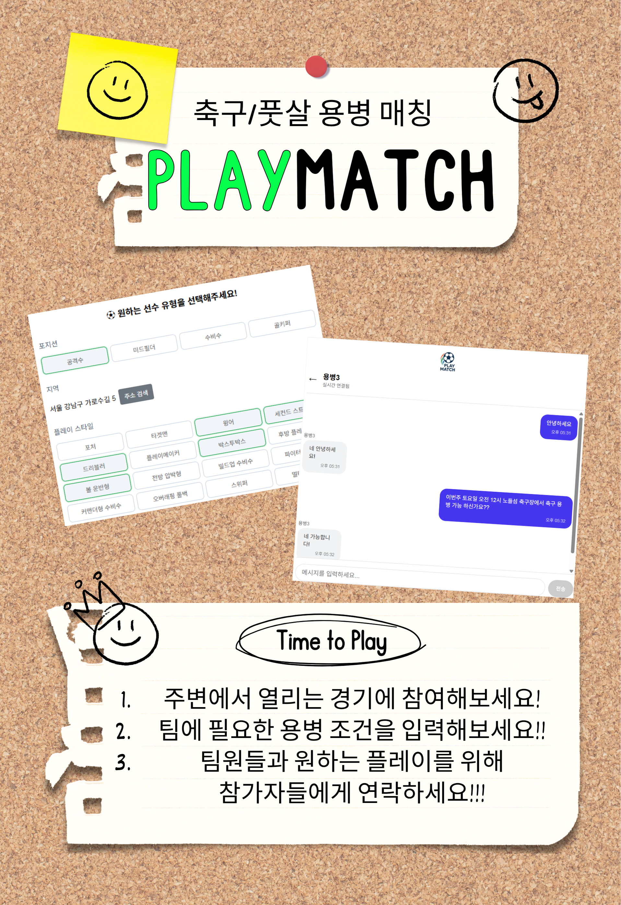
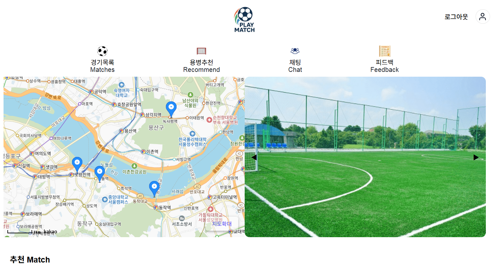
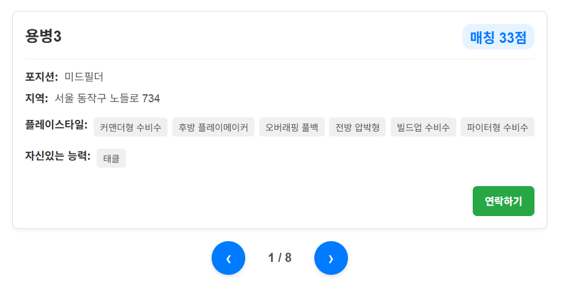
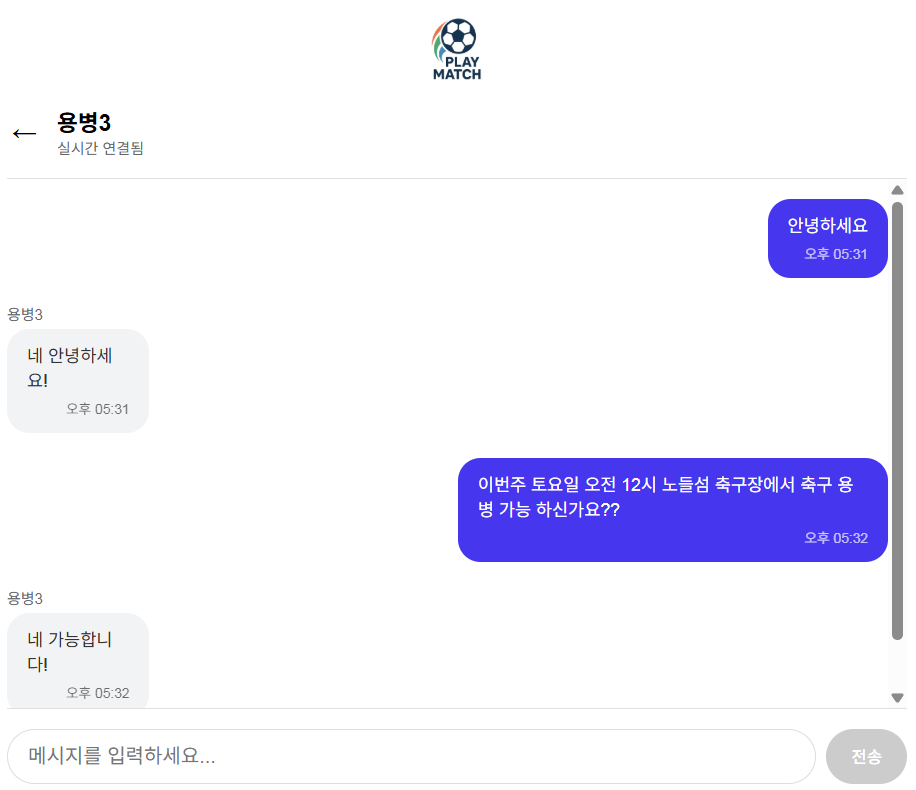
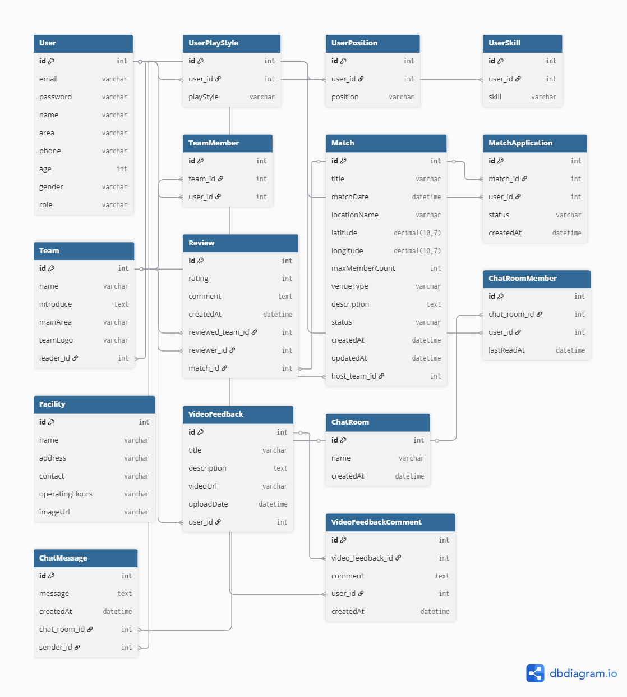

# 🚀 PlayMatch: Spring Boot & React 기반 축구/풋살 매칭 플랫폼

<details>
<summary>👉 프로젝트 홍보 포스터 보기 (클릭하여 펼치기)</summary>



</details>

     



## 1. 📖 프로젝트 개요

`PlayMatch`는 아마추어 축구 및 풋살 팀을 위한 매칭 플랫폼으로, 팀 관리, 경기 매칭, 그리고 팀원(용병) 모집을 원활하게 할 수 있도록 돕는 서비스입니다. Spring Boot와 React를 기반으로 하여 안정적인 백엔드와 반응형 프론트엔드를 구축했으며, 사용자 경험을 극대화하기 위해 실시간 채팅, 좌표 기반 추천 등 다양한 기술을 적용했습니다.

---

## 2. ✨ 주요 기능 (Key Features)

- **🧠 지능형 용병 추천:** 거리, 포지션, 스킬 등 복합적인 가중치를 적용하여 팀에 가장 적합한 용병을 추천합니다.
- **💬 실시간 채팅:** WebSocket(STOMP)과 Redis를 이용하여 서버 확장에도 유연하게 대응할 수 있는 실시간 채팅 기능을 제공합니다.
- **⚽ 팀 및 경기 관리:** 팀과 경기를 생성, 조회, 수정, 삭제하는 기본적인 매칭 플랫폼의 기능을 구현했습니다.
- **🎬 비디오 피드백:** 경기 영상을 업로드하고 댓글을 통해 피드백을 주고받는 커뮤니티 기능을 제공합니다.
- **🗺️ 지도 기반 탐색:** Kakao Map API를 연동하여 주변의 경기나 팀을 직관적으로 탐색할 수 있습니다.

---

## 3. 🏛️ 시스템 아키텍처

본 프로젝트는 역할과 책임 분리를 통해 유지보수성과 확장성을 높이는 현대적인 웹 애플리케이션 아키텍처를 채택했습니다.

- **Backend: 계층형 아키텍처 (Layered Architecture)**
  - **Controller Layer:** 클라이언트의 HTTP 요청을 받아 서비스 계층으로 처리를 위임합니다.
  - **Service Layer:** 애플리케이션의 핵심 비즈니스 로직을 처리하고 트랜잭션을 관리합니다.
  - **Repository Layer:** Spring Data JPA를 사용하여 데이터베이스와의 통신을 담당합니다.
  - **Domain Layer:** 데이터베이스 테이블과 매핑되는 핵심 데이터 모델입니다.

- **Frontend: 컴포넌트 기반 아키텍처 (Component-Based Architecture)**
  - **Pages & Components:** 각 페이지와 재사용 가능한 UI 단위로 UI를 설계하여 개발 효율성을 높였습니다.
  - **Services:** 백엔드 API 호출을 담당하는 모듈로 UI 로직과 비즈니스 로직을 분리합니다.
  - **Context API:** 전역 상태(로그인 정보 등)를 관리합니다.

---

## 4. 📸 핵심 기능 시연

### 지능형 용병 추천

*사용자가 원하는 포지션, 스킬, 지역을 선택하면, 하버사인 공식(Haversine formula)을 이용한 거리 점수를 포함한 복합적인 가중치 시스템을 통해 최적의 용병을 추천합니다. 결과는 넘겨볼 수 있는 캐러셀 UI로 제공되며, '연락하기' 버튼으로 즉시 1:1 채팅을 시작할 수 있습니다.*

### 실시간 채팅

*STOMP와 Redis 메시지 브로커를 기반으로 구현된 실시간 채팅 화면입니다. 이를 통해 여러 서버 인스턴스 환경에서도 지연 없이 안정적인 메시지 송수신이 가능합니다.*

---

## 5. 🛠️ 기술 스택 (Tech Stack)

| 구분 | 기술 | 상세 내용 |
| :--- | :--- | :--- |
| **Backend** | ☕ Java 17 | | 
| | 🍃 Spring Boot 3.x | Spring Security, Spring Data JPA, WebSocket |
| | 🐘 Gradle | 의존성 관리 및 빌드 도구 |
| | 🐘 PostgreSQL | 주 데이터베이스 |
| | ⚡ Redis | 채팅 메시지 브로커 및 JWT 블랙리스트 관리 |
| | 🔑 JWT | JSON Web Token 기반 인증 |
| **Frontend** | ⚛️ React | UI 라이브러리 |
| | 🔷 TypeScript | 타입 안정성 확보 |
| | ⚡ Vite | 차세대 프론트엔드 빌드 도구 |
| | 🎨 CSS3 | 스타일링 |
| **APIs** | 🗺️ Kakao Maps API | 지도 표시, 주소-좌표 변환 |
| | 📮 Kakao Postcode API | 주소 검색 |

---

## 6. ⚙️ 로컬 환경에서 실행하기

### 사전 준비
- Java 17
- Node.js 20.x
- Docker

### 1. 데이터베이스 및 Redis 실행

프로젝트 루트의 `docker-compose.yml` 파일을 사용하여 PostgreSQL과 Redis를 실행합니다.

```bash
docker-compose up -d
```

### 2. 백엔드 서버 실행

1.  `build.gradle` 파일의 `plugins`가 아래와 같이 설정되어 있는지 확인합니다.

    ```groovy
    plugins {
        id 'java'
        id 'org.springframework.boot' version '3.3.2'
        id 'io.spring.dependency-management' version '1.1.5'
    }
    ```

2.  `src/main/resources/application.yml` 파일을 열어 본인의 환경에 맞게 수정합니다.

    ```yaml
    spring:
      datasource:
        password: YOUR_DATABASE_PASSWORD # 여기에 본인의 DB 비밀번호를 입력하세요.
    jwt:
      secret:
        key: YOUR_JWT_SECRET_KEY # 여기에 256비트 이상의 긴 무작위 문자열을 입력하세요.
    ```

3.  아래 명령어로 백엔드 서버를 실행합니다. (기본 포트: `8080`)

    ```bash
    ./gradlew bootRun
    ```

### 3. 프론트엔드 서버 실행

1.  `frontend` 디렉토리로 이동하여 의존성을 설치합니다.

    ```bash
    cd frontend
    npm install
    ```

2.  `frontend/.env` 파일을 생성하고, 백엔드 서버 주소를 입력합니다.

    ```
    VITE_API_BASE_URL=http://localhost:8080
    ```

3.  아래 명령어로 프론트엔드 개발 서버를 실행합니다. (기본 포트: `5173`)

    ```bash
    npm run dev
    ```

4.  브라우저에서 `http://localhost:5173`으로 접속합니다.

---

## 7. 📚 프로젝트 문서

이 섹션에서는 프로젝트의 더 깊은 이해를 돕기 위한 다양한 문서들을 제공합니다.

- **[ERD (Entity-Relationship Diagram)](./docs/ERD.png)**
- **[졸업 작품 발표 요약](./docs/graduation_presentation_summary.md)**
- **[트러블슈팅 및 향후 계획](./docs/troubleshooting_and_future_plans.md)**

<details>
<summary>👉 ERD 보기</summary>



</details>

<details>
<summary>👉 졸업 작품 발표 요약 보기</summary>

# PlayMatch: Spring Boot & React 기반 축구/풋살 매칭 플랫폼

## 1. 프로젝트 개요

`PlayMatch`는 아마추어 축구 및 풋살 팀을 위한 매칭 플랫폼으로, 팀 관리, 경기 매칭, 그리고 팀원(용병) 모집을 원활하게 할 수 있도록 돕는 서비스입니다. Spring Boot와 React를 기반으로 하여 안정적인 백엔드와 반응형 프론트엔드를 구축했으며, 사용자 경험을 극대화하기 위해 실시간 채팅, 좌표 기반 추천 등 다양한 기술을 적용했습니다.

---

## 2. 시스템 아키텍처

본 프로젝트는 역할과 책임 분리를 통해 유지보수성과 확장성을 높이는 현대적인 웹 애플리케이션 아키텍처를 채택했습니다.

### 2.1. 백엔드: 계층형 아키텍처 (Layered Architecture)

Spring Boot의 표준적인 아키텍처 패턴을 따르며, 각 계층은 명확히 구분된 역할을 수행합니다.

- **Controller Layer (`@RestController`):** 클라이언트의 HTTP 요청을 받아 유효성을 검증하고, 서비스 계층으로 처리를 위임한 뒤, 그 결과를 HTTP 응답으로 반환합니다. (MVC 패턴의 Controller 역할)
- **Service Layer (`@Service`):** 애플리케이션의 핵심 비즈니스 로직을 처리합니다. 트랜잭션 관리 등 핵심 로직이 이곳에서 수행됩니다.
- **Repository Layer (`@Repository`):** Spring Data JPA를 사용하여 데이터베이스와의 통신(CRUD)을 담당합니다.
- **Domain Layer (`@Entity`):** 데이터베이스 테이블과 매핑되는 핵심 데이터 모델입니다. (MVC 패턴의 Model 역할)

### 2.2. 프론트엔드: 컴포넌트 기반 아키텍처 (Component-Based Architecture)

React의 핵심 사상인 컴포넌트 기반으로 UI를 설계하여, 코드의 재사용성과 개발 효율성을 높였습니다.

- **Pages:** 각 페이지(라우트)를 의미하는 최상위 컴포넌트입니다.
- **Components:** 버튼, 입력창, 카드 등 재사용 가능한 UI 단위입니다.
- **Services:** 백엔드 API 호출을 담당하는 모듈로, UI 컴포넌트로부터 비즈니스 로직을 분리합니다.
- **Context API:** 전역 상태(로그인 정보, 매치 목록 등)를 관리하여 컴포넌트 간 데이터 전달을 용이하게 합니다.

---

## 3. 핵심 기능 상세

### 3.1. 지능형 용병 추천 시스템

팀에 부족한 용병을 지능적으로 추천받는 핵심 기능입니다.

- **기능:** 사용자가 원하는 용병의 조건(포지션, 플레이 스타일, 능력, **활동 지역**)을 입력하면, 시스템에 등록된 다른 사용자 중에서 가장 적합한 순으로 추천 목록을 제공합니다.
- **핵심 로직:**
  - **가중치 기반 점수 시스템:** 조건별 중요도에 따라 차등 점수를 부여하여 '매칭 점수'를 계산합니다.
  - **좌표 기반 거리 계산:** 하버사인 공식(Haversine Formula)을 이용해 실제 거리를 계산하고, 근접성에 따라 높은 가중치(최대 20점)를 부여합니다.
- **UI/UX:** 검색 결과는 한 명씩 넘겨볼 수 있는 캐러셀(Carousel) 형태로 제공되며, '연락하기' 버튼으로 즉시 1:1 채팅을 시작할 수 있습니다.

### 3.2. 실시간 채팅 시스템

사용자 간의 원활한 소통을 위해 웹소켓(WebSocket) 기반의 실시간 채팅 기능을 구현했습니다.

- **핵심 기술:**
  - **STOMP:** 메시지 발행(Publish) 및 구독(Subscribe) 모델을 쉽게 구현하기 위한 프로토콜로 사용했습니다.
  - **Redis:** 메시지 브로커 역할을 수행합니다. 이를 통해 서버가 여러 대로 확장(Scale-out)되어도 모든 서버의 사용자가 메시지를 주고받을 수 있는 확장성 높은 구조를 확보했습니다.

### 3.3. 비디오 피드백 게시판

경기 영상이나 개인 훈련 영상을 업로드하여 다른 사용자들로부터 피드백(댓글)을 받을 수 있는 커뮤니티 기능입니다.

- **주요 기능:** 동영상 업로드, 상세 보기, 댓글 작성/수정/삭제 기능을 제공합니다.
- **권한 관리:** Spring Security와 연동하여, 영상 및 댓글의 수정/삭제는 작성자 본인만 가능하도록 서버 레벨에서 권한을 제어합니다.

### 3.4. 지도 기반 경기 조회

예정된 경기들의 위치를 지도 위에 시각적으로 표시하여 사용자가 쉽게 주변의 경기를 탐색할 수 있도록 합니다.

- **핵심 기술:** Kakao Map API를 활용하여 경기 장소의 주소를 좌표로 변환하고, 지도 위에 마커로 표시합니다.
- **사용자 경험:** 단순 목록이 아닌 지도를 통해 경기 정보를 직관적으로 탐색할 수 있습니다.

### 3.5. 사용자 및 팀 관리

서비스의 기본이 되는 사용자 인증 및 팀 생성/관리 기능입니다.

- **사용자:** JWT(JSON Web Token) 기반의 인증 시스템을 구축하여 보안성을 높였습니다. 회원가입 시 상세 프로필(포지션, 스킬 등)을 입력받아 추천 시스템의 기반 데이터로 활용합니다.
- **팀:** 사용자는 팀을 생성하고, 팀 로고, 소개, 최대 인원 등을 설정할 수 있습니다. 팀 정보 수정 및 팀원 관리 기능을 제공합니다.

---

## 4. 사용된 주요 기술 스택

- **Backend:** Java, Spring Boot, Spring Security, JPA/Hibernate, Gradle, PostgreSQL, Redis
- **Frontend:** React, TypeScript, Vite, CSS
- **API & Libraries:** Kakao Maps API, Kakao Postcode API

</details>

<details>
<summary>👉 트러블슈팅 및 향후 계획 보기</summary>

# 겪었던 문제와 해결 과정 (Troubleshooting)

## 1. 팀 로고 미표시 문제

- **증상:** 팀 생성 시 로고를 업로드했음에도, 프로필 페이지에서 이미지가 보이지 않고 깨진 이미지 아이콘과 `alt` 텍스트만 표시됨. 개발자 도구에서는 `403 Forbidden` 또는 잘못된 URL로의 요청이 확인됨.
- **원인 분석:**
  - **1차 원인 (보안):** Spring Security가 정적 리소스 경로인 `/uploads/**`에 대한 `GET` 요청을 인증되지 않은 사용자의 접근으로 간주하고 차단하고 있었습니다.
  - **2차 원인 (데이터 오염):** 팀 정보 수정 시, 이미 `/uploads/`가 붙은 전체 이미지 경로가 데이터베이스에 다시 저장되었습니다. 이로 인해 다음 조회 시 `/uploads//uploads/...`와 같이 경로가 중복으로 누적되어 잘못된 URL이 생성되었습니다.
- **해결:**
  - **`SecurityConfig` 수정:** `/uploads/**` 경로에 대해 `HttpMethod.GET` 요청은 모두 허용하도록 `permitAll()` 규칙을 명시적으로 강화했습니다.
  - **`Team.update` 로직 수정:** 정보 수정 시 `teamLogo` 필드는 업데이트되지 않도록 하여, 경로가 중복 저장되는 근본 원인을 차단했습니다.
  - **DTO 방어 로직 추가:** 이미 오염된 데이터가 있어도 정상 출력되도록, DTO 생성 시 경로에서 순수 파일명만 추출한 뒤 항상 `/uploads/`를 붙여주는 데이터 정제 로직을 추가했습니다.

## 2. Spring Test 환경과 WebSocket 설정 충돌

- **증상:** `spring-boot-starter-websocket` 의존성 추가 후, 원인을 알 수 없는 `Context Loading` 실패 에러가 발생하며 모든 테스트(30개 이상)가 실패. 빌드 초기화 직후 첫 테스트는 성공하지만, 이후 모든 테스트가 실패하는 `Flaky Test` 현상 발생.
- **원인 분석:** `@SpringBootTest`가 구성하는 모의(Mock) 웹 환경과, `@EnableWebSocketMessageBroker`가 실제 메시징 시스템을 구성하려는 시도가 충돌하여 정상적인 Bean 생성을 방해했습니다.
- **해결:** `@Profile("!test")` 어노테이션을 `WebSocketConfig`와 관련 컨트롤러에 추가하여, 테스트 환경(`@ActiveProfiles("test")`)에서는 WebSocket 관련 설정이 아예 로드되지 않도록 환경을 원천적으로 분리했습니다.

## 3. 컨트롤러 통합 테스트의 연쇄적 실패

- **증상:** `TeamControllerTest`와 `ReviewControllerTest`에서 `403 Forbidden`, `AssertionError`, `NullPointerException` 등 다양한 오류가 복합적으로 발생하며 테스트 실패.
- **원인 분석:**
  - **인증 문제:** 직접 구현한 `JwtAuthorizationFilter`가 Spring Security 테스트 유틸리티(`@WithMockUser`)보다 먼저 동작하여, `Authorization` 헤더가 없는 모든 테스트 요청을 차단했습니다.
  - **인가 문제:** 컨트롤러의 `@PreAuthorize` 어노테이션에 사용된 SpEL 표현식(`principal.name`)이 테스트용 인증 객체와 호환되지 않았습니다.
  - **시나리오 문제:** 테스트 케이스가 가정한 시나리오(예: 상대팀 리뷰)가 실제 시스템의 도메인 모델('주최팀+용병' 모델)과 일치하지 않아 잘못된 결과를 기대하고 있었습니다.
- **해결:**
  - **인증 해결:** JWT 필터를 거치지 않고 `SecurityContext`에 직접 테스트용 인증 객체를 주입하는 `SecurityMockMvcRequestPostProcessors.user()`를 사용했습니다.
  - **인가 해결:** SpEL 표현식을 테스트 환경과 호환되는 `authentication.name`으로 수정했습니다.
  - **시나리오 해결:** 실제 도메인 모델에 맞게 '셀프 리뷰 금지', '미참여자 리뷰 금지' 등으로 테스트 케이스를 재설계하고, 그에 맞는 예외 처리를 검증하도록 수정했습니다.

---

# 향후 고도화 계획

## 1. 소셜 로그인 도입

- **내용:** OAuth2를 이용한 Google, Naver, Kakao 로그인 기능을 추가하여 사용자 접근성을 높입니다.
- **기대 효과:** 회원가입 절차를 간소화하여 신규 사용자 유입을 증대시킬 수 있습니다.

## 2. 실시간 알림 기능 구현

- **내용:** WebSocket 또는 SSE(Server-Sent Events)를 활용하여 새 채팅 메시지, 경기 신청, 팀 가입 승인 등에 대한 실시간 알림 기능을 구현합니다.
- **기대 효과:** 사용자가 앱의 주요 변경 사항을 즉시 인지하여 서비스 참여도를 높일 수 있습니다.

## 3. 실제 Geocoding API 연동 및 테스트 환경 고도화

- **내용:** 현재 Mock 데이터로 처리 중인 `KakaoApiService`를 실제 카카오 지도 API와 연동하고, 발급받은 API 키를 `Vault`나 `AWS Parameter Store` 등을 통해 안전하게 관리합니다.
- **기대 효과:** 실제 주소 기반의 정확한 좌표 데이터를 사용하여, 추천 시스템의 신뢰도를 향상시킵니다.

## 4. 검색 기능 고도화

- **내용:** 팀, 경기, 사용자에 대한 다각적인 필터링(예: 실력, 매너 점수, 날짜 범위) 및 정렬 기능을 추가합니다.
- **기대 효과:** 사용자가 원하는 정보를 더 빠르고 정확하게 찾을 수 있도록 하여 서비스 만족도를 높입니다.

## 5. CI/CD 파이프라인 구축

- **내용:** GitHub Actions와 Docker를 사용하여 테스트, 빌드, 배포 과정을 자동화하는 CI/CD 파이프라인을 구축합니다.
- **기대 효과:** 코드 변경사항을 프로덕션 환경에 더 빠르고 안정적으로 배포할 수 있습니다.

## 6. 테스트 커버리지 확대

- **내용:** 주요 비즈니스 로직에 대한 JaCoCo 등의 도구를 사용하여 테스트 커버리지를 측정하고, 부족한 부분에 대한 Unit Test 및 Integration Test 코드를 추가하여 코드 안정성을 확보합니다.
- **기대 효과:** 버그 발생 가능성을 줄이고, 리팩토링에 대한 안정성을 확보하여 유지보수 비용을 절감합니다.

</details>

<details>
<summary>👉 채팅 및 빌드 관련 트러블슈팅 보기</summary>

## PlayMatch 프로젝트: 채팅 기능 구현 중 발생한 빌드 시스템 충돌 문제 해결기

### 1. 문제 현상

채팅 기능 구현을 위해 `spring-boot-starter-websocket` 의존성을 추가한 직후, 원인을 알 수 없는 `Context Loading` 실패 에러가 발생하며 모든 테스트(30개 이상)가 실패하기 시작했다. 에러 로그는 `java.lang.IllegalStateException at Assert.java:97`를 가리켰지만, 직접적인 원인을 파악하기 어려웠다.

특히, `gradlew clean`이나 `gradlew --stop` 명령어로 빌드 환경을 초기화한 직후의 첫 테스트는 성공하지만, 그 다음 테스트부터는 100% 실패하는 'Flaky Test(변덕스러운 테스트)' 현상이 발생하여 디버깅에 큰 어려움을 겪었다.

### 2. 초기 진단 및 실패 과정

초기에는 WebSocket 관련 설정이 기존의 웹 및 보안 설정과 충돌했을 것으로 가정하고 아래와 같은 해결책들을 순서대로 시도했으나, 모두 실패했다.

*   **1차 시도: 컨트롤러 역할 분리**
    *   가설: `@RestController`와 `@MessageMapping`이 한 클래스에 공존하여 발생한 충돌.
    *   조치: 기존 `ChatController`를 `ChatApiController`(REST)와 `StompChatController`(WebSocket)로 분리.
    *   결과: 실패. 동일한 컨텍스트 로딩 에러 발생.

*   **2차 시도: Spring Security 경로 허용**
    *   가설: Spring Security가 WebSocket 핸드셰이크 경로(`/ws-stomp`)를 차단.
    *   조치: `SecurityConfig`에 해당 경로를 `permitAll()`로 명시적으로 허용.
    *   결과: 실패. 동일한 컨텍스트 로딩 에러 발생.

*   **3차 시도: STOMP 인증 방식 변경**
    *   가설: `@MessageMapping` 메서드에서 사용자 인증 정보(`Principal`, `@AuthenticationPrincipal`) 주입 방식의 문제.
    *   조치: `Principal` -> `@AuthenticationPrincipal` -> `SimpMessageHeaderAccessor` -> 클라이언트에서 `sender` 정보 직접 전송 등 다양한 방식으로 수정.
    *   결과: `NullPointerException` 등 2차적인 에러만 발생했을 뿐, 근본적인 컨텍스트 로딩 문제는 해결되지 않음.

### 3. 근본 원인 재분석 및 최종 해결

모든 시도가 실패하고, `clean` 직후에만 테스트가 성공하는 현상을 통해 문제의 원인이 코드 레벨이 아닌 **빌드 시스템과 테스트 환경의 설정 충돌**에 있음을 확신하게 되었다.

`@EnableWebSocketMessageBroker` 어노테이션이 활성화되면, 스프링 부트는 테스트 환경에서도 실제 메시징 시스템을 구성하려 시도한다. 이 과정이 `@SpringBootTest`가 구성하는 모의(Mock) 웹 환경과 충돌을 일으켜, 정상적인 빈(Bean) 생성을 방해하고 컨텍스트 로딩 실패로 이어졌던 것이다.

**최종 해결책: `@Profile`을 이용한 테스트 환경 분리**

*   **조치:**
    1.  `WebSocketConfig` 클래스에 `@Profile("!test")` 어노테이션을 추가했다.
    2.  `WebSocketConfig`에 의존하는 `StompChatController` 클래스에도 동일하게 `@Profile("!test")`를 추가했다.
*   **결과:**
    *   `@ActiveProfiles("test")`가 적용된 테스트 환경에서는 WebSocket 관련 설정과 컨트롤러가 아예 로드되지 않도록 원천적으로 분리했다.
    *   이를 통해 기존의 모든 REST API 테스트는 WebSocket의 영향을 받지 않고 안정적으로 실행될 수 있게 되었다.
    *   이후, 채팅 기능의 REST API 부분에 대한 테스트(`ChatApiControllerTest`)를 작성했고, 모든 테스트가 성공적으로 통과하는 것을 확인했다.

### 4. 결론 및 교훈

이번 트러블슈팅을 통해, 단순히 코드를 작성하는 것뿐만 아니라 코드가 실행되는 '환경(Environment)'과 '설정(Configuration)'의 중요성을 깊이 깨달았다.

*   `@SpringBootTest`는 실제 구동 환경과 미묘한 차이가 있으며, 특히 자동 설정(Auto-configuration)에 크게 의존하는 외부 라이브러리(WebSocket 등)를 추가할 때는 테스트 환경과의 충돌 가능성을 인지하고 **프로필 분리(`@Profile`)**를 적극적으로 고려해야 함을 배웠다.
*   원인을 알 수 없는 빌드/테스트 실패가 반복될 때는, 코드의 논리적 오류만 파고들 것이 아니라, 한 걸음 물러나 **빌드 시스템의 캐시 문제나 실행 환경 자체의 문제**를 의심하고, 환경을 완전히 초기화(`clean`, `stop` 또는 프로젝트 재구성)하는 과감한 시도가 필요함을 깨달았다.
*   가장 중요한 것은, 끈기를 가지고 다양한 가설을 세우고 검증하며, 실패 로그를 통해 꾸준히 단서를 찾아 나가는 문제 해결 과정 그 자체였다.

</details>

<details>
<summary>👉 리뷰 및 팀 컨트롤러 테스트 관련 트러블슈팅 보기</summary>

# 리뷰 시스템 테스트 오류 트러블슈팅

## 1. 문제 상황

리뷰 시스템 구현 후, `ReviewControllerTest`에서 지속적으로 테스트 오류가 발생했습니다. 처음에는 `@WithUserDetails` 어노테이션과 관련된 `TestExecutionEvent` 클래스를 찾지 못하는 컴파일 오류가 발생했고, 이를 해결하기 위해 인증 방식을 단순화한 후에는 `AssertionError`가 발생하며 테스트가 실패했습니다.

## 2. 근본 원인

### 원인 1: 복잡한 테스트 인증 환경

최초의 `TestExecutionEvent` 오류는 `@WithUserDetails`를 사용하는 과정에서 테스트 실행 컨텍스트가 복잡하게 꼬이면서 발생했습니다. Spring Security 테스트 환경에 대한 깊은 이해 없이는 디버깅이 매우 어려운 문제였습니다.

### 원인 2: 도메인 모델과 테스트 케이스의 불일치

`AssertionError`는 근본적으로 **테스트 케이스가 의도한 시나리오**와 **실제 도메인 모델 및 서비스 로직** 간의 불일치 때문에 발생했습니다.

- **테스트의 가정**: '주최팀 vs 상대팀'이라는 `팀 대 팀` 매치 상황을 가정하고 테스트 케이스를 작성했습니다. (예: 주최팀 멤버가 상대팀을 리뷰)
- **실제 로직**: 하지만 `Match` 엔티티에는 `opponentTeam` 필드가 없었고, 시스템은 오직 '주최팀 + 용병' 모델만을 지원하고 있었습니다.
- **결과**: 서비스 로직은 '상대팀'의 존재를 모르기 때문에, '참여자'를 오직 '용병'으로만 인식했습니다. 이로 인해 테스트는 '상대팀' 멤버를 '미참여자'로 판단하여 잘못된 예외를 발생시켰고, `AssertionError`로 이어졌습니다.

## 3. 해결 과정

문제를 근본적으로 해결하기 위해, 복잡한 요소를 모두 제거하고 현재 시스템의 설계에 맞게 코드와 테스트를 정렬하는 방향으로 진행했습니다.

### 1단계: 인증 방식 단순화

- **Controller 수정**: `@AuthenticationPrincipal`을 통해 `UserDetails` 객체를 직접 주입받던 방식에서, 표준 `java.security.Principal` 객체를 사용하도록 변경했습니다. 이를 통해 Spring Security에 대한 의존도를 낮추고 코드를 단순화했습니다.
- **Test 수정**: 문제가 되었던 `@WithUserDetails`를 제거하고, 훨씬 간단하고 직관적인 `@WithMockUser`를 사용하여 테스트용 가짜 사용자를 생성했습니다.

### 2단계: 서비스 로직 및 테스트 케이스 수정

- **`ReviewService` 로직 수정**:
    1.  **참여자 자격 명확화**: 리뷰 작성 자격을 '주최팀 멤버' 또는 '수락된 용병'으로 명확히 정의했습니다.
    2.  **셀프 리뷰 방지**: 리뷰어가 자신의 팀을 리뷰할 수 없도록 하는 방어 로직을 추가했습니다.
    3.  **에러 메시지 통일**: 로직에 맞춰 발생하는 예외 메시지를 명확하게 통일했습니다.

- **`ReviewControllerTest` 케이스 수정**:
    1.  **'셀프 리뷰' 테스트**: '주최팀 멤버가 상대팀을 리뷰'하는 잘못된 시나리오 대신, '주최팀 멤버가 자신의 팀을 리뷰'하는 시나리오로 변경하여 셀프 리뷰 방지 로직을 검증하도록 수정했습니다.
    2.  **'미참여자' 테스트**: '상대팀 멤버'라는 존재하지 않는 개념 대신, 경기에 어떤 방식으로든 관여하지 않은 사용자가 리뷰를 작성하는 상황을 테스트하고, 서비스 로직과 일치하는 예외 메시지를 검증하도록 수정했습니다.

## 4. 결론

`BUILD SUCCESSFUL`

위의 단계를 통해 모든 테스트가 성공적으로 통과하는 것을 확인했습니다. 이번 트러블슈팅을 통해 **테스트 케이스는 반드시 현재 시스템의 도메인 모델과 비즈니스 로직을 정확하게 반영해야 한다**는 중요한 교훈을 얻었습니다. 존재하지 않는 기능을 가정하고 테스트를 작성하는 것은 로직의 결함이 아닌, 테스트 자체의 결함으로 이어질 수 있습니다.

---

# `TeamControllerTest` 통합 테스트 연쇄 실패 트러블슈팅

## 1. 문제 상황

`TeamController`의 통합 테스트 실행 시, 다수의 테스트가 `AssertionError`와 함께 실패했습니다. 초기 증상은 API 응답 JSON에서 `leaderName` 필드가 `null`로 반환되는 문제였으며, 이후 `403 Forbidden`, `NullPointerException` 등 다양한 오류가 복합적으로 발생하며 디버깅에 극심한 혼란을 야기했습니다.

## 2. 원인 분석의 함정과 잘못된 접근

문제의 본질을 파악하지 못하고, 겉으로 드러난 증상(`leaderName: null`)에만 집중하여 다음과 같은 잘못된 가설들을 세우고 검증하는 과정을 수차례 반복했습니다.

- **가설 1 (데이터):** JPA 영속성 컨텍스트 또는 트랜잭션 문제로 테스트 데이터 조회가 누락된다고 판단. (`@Transactional` 제거, `saveAndFlush` 등 시도 -> 실패)
- **가설 2 (매핑):** 엔티티와 DB 컬럼 매핑 오류를 의심. (DB 스키마 확인 결과 정상 -> 가설 폐기)
- **가설 3 (CSRF):** `GET`은 성공, `PUT`/`POST`는 실패하는 현상을 보고 CSRF 문제를 의심. (`.with(csrf())` 추가 -> 실패)

## 3. 진짜 원인: Spring Security와 테스트 환경의 상호작용

수많은 실패 끝에, 모든 문제의 근원은 **Spring Security 설정**과 **테스트 환경의 인증 방식** 간의 복잡한 상호작용 때문임을 발견했습니다.

- **원인 1: 커스텀 JWT 필터의 우선순위:** 애플리케이션의 `JwtAuthorizationFilter`가 Spring Security 테스트 유틸리티(`@WithMockUser`, `.with(user())` 등)보다 먼저 실행되어, `Authorization: Bearer` 헤더가 없는 모든 요청을 `403 Forbidden`으로 차단하고 있었습니다.
- **원인 2: 테스트용 인증 객체와 SpEL의 비호환성:** `.with(user())`로 생성된 테스트용 `Authentication` 객체는, 컨트롤러의 `@PreAuthorize` 어노테이션에 사용된 SpEL 표현식(`principal.name`)과 호환되지 않았습니다. 이로 인해 SpEL 평가가 실패하며 `403 Forbidden`이 발생했습니다.

## 4. 최종 해결 과정

진짜 원인을 파악한 후, 다음과 같이 단계적으로 문제를 해결하여 모든 테스트를 통과시켰습니다.

- **1단계 (인증 문제 해결):**
    - **문제:** `JwtAuthorizationFilter`가 테스트 요청을 차단 (`403 Forbidden`).
    - **해결:** `SecurityMockMvcRequestPostProcessors.user()`를 사용하여, JWT 필터를 통과할 필요 없이 `SecurityContext`에 직접 테스트용 인증 객체를 설정했습니다.

- **2단계 (인가 문제 해결):**
    - **문제:** `PUT` 요청에서만 `403 Forbidden` 발생.
    - **원인:** 컨트롤러의 `@PreAuthorize("@teamService.isLeader(#teamId, principal.name)")` SpEL 표현식이 테스트 인증 객체와 호환되지 않았습니다.
    - **해결:** SpEL 표현식을 `authentication.name`으로 수정 (`@PreAuthorize("@teamService.isLeader(#teamId, authentication.name)")`)하여 테스트 환경의 인증 객체와 호환되도록 수정했습니다.

- **3단계 (잘못된 테스트 기대값 수정):**
    - **문제:** `updateTeam_Fail_NotLeader` 테스트가 `400`을 기대했지만, `@PreAuthorize`의 정상 동작 결과인 `403`을 받으며 실패했습니다.
    - **원인:** 테스트의 기대값이 실제 동작과 달랐습니다.
    - **해결:** 테스트의 기대값을 `status().isForbidden()` (403)으로 수정했습니다.

## 5. 결론 및 교훈

- **최종 결과:** 위의 모든 수정을 통해 `TeamControllerTest`의 모든 테스트가 마침내 통과 (`BUILD SUCCESSFUL`).
- **교훈 1: 통합 테스트의 복잡성:** 통합 테스트는 데이터, 비즈니스 로직, 보안 등 여러 계층이 복합적으로 상호작용하므로, 단일 계층의 문제로 단정하지 말고 폭넓은 시야로 접근해야 합니다.
- **교훈 2: 보안 테스트 환경의 정확한 이해:** Spring Security 테스트는 실제 보안 필터 체인의 동작 방식과 테스트 유틸리티가 생성하는 `SecurityContext`의 구조적 차이를 명확히 이해해야 합니다. 특히 커스텀 필터가 존재할 경우, 그 우선순위와 동작 방식을 반드시 고려해야 합니다.
- **교훈 3: 오류 로그의 신중한 해석:** `403 Forbidden`이라는 명백한 신호를 초기에 간과하고 다른 문제에 매몰되어 디버깅 시간이 길어졌습니다. 오류의 가장 표면적인 정보부터 신중하게 해석하는 것이 중요합니다.

</details>

---

## 8. 📚 전체 API 명세

<details>
<summary>👉 전체 API 명세 보기 (클릭하여 펼치기)</summary>

### 1. 사용자 인증 및 프로필 (Auth & Users)

| Method | Path | 설명 |
| :--- | :--- | :--- |
| `POST` | `/api/auth/register` | 회원가입 |
| `POST` | `/api/auth/login` | 로그인 (JWT 토큰 발급) |
| `POST` | `/api/auth/logout` | 로그아웃 (서버에서 토큰 만료 처리) |
| `GET` | `/api/users/me` | 현재 로그인한 내 프로필 정보 조회 |
| `PUT` | `/api/users/me` | 내 프로필 정보 수정 |
| `GET` | `/api/users/{userId}` | 특정 사용자의 프로필 정보 조회 |

### 2. 팀 (Teams)

| Method | Path | 설명 |
| :--- | :--- | :--- |
| `POST` | `/api/teams` | 신규 팀 생성 |
| `GET` | `/api/teams` | 전체 팀 목록 조회 (검색 포함) |
| `GET` | `/api/teams/my` | 내가 속한 팀 목록 조회 |
| `GET` | `/api/teams/{teamId}` | 특정 팀의 상세 정보 조회 |
| `PUT` | `/api/teams/{teamId}` | 팀 정보 수정 |
| `DELETE` | `/api/teams/{teamId}` | 팀 삭제 |
| `POST` | `/api/teams/{teamId}/apply` | 특정 팀에 가입 신청 |
| `GET` | `/api/teams/{teamId}/applications` | 특정 팀의 가입 신청 목록 조회 (팀장) |
| `POST` | `/api/teams/{teamId}/applications/{applicationId}` | 가입 신청 상태 변경 (수락/거절) (팀장) |

### 3. 경기 (Matches)

| Method | Path | 설명 |
| :--- | :--- | :--- |
| `POST` | `/api/matches` | 신규 경기 생성 |
| `GET` | `/api/matches` | 전체 경기 목록 조회 |
| `GET` | `/api/matches/{matchId}` | 특정 경기의 상세 정보 조회 |
| `POST` | `/api/matches/{matchId}/apply` | 특정 경기에 용병으로 참여 신청 |
| `GET` | `/api/matches/{matchId}/participants` | 특정 경기의 참여자 목록 조회 |

### 4. 용병 추천 (Recommendations)

| Method | Path | 설명 |
| :--- | :--- | :--- |
| `POST` | `/api/recommendations/players` | 조건 기반 용병 추천 목록 조회 |

### 5. 실시간 채팅 (Chat)

| Type | Path | 설명 |
| :--- | :--- | :--- |
| `GET` | `/api/chat/my-rooms` | 내 채팅방 목록 조회 |
| `POST` | `/api/chat/rooms` | 1:1 채팅방 생성 또는 기존 채팅방 조회 |
| `GET` | `/api/chat/rooms/{roomId}/messages`| 특정 채팅방의 이전 대화 내용 조회 |
| `GET` | `/api/chat/unread-count` | 읽지 않은 전체 메시지 수 조회 |
| `(WS)` | `pub/chat/message` | STOMP를 통한 메시지 발행(전송) |
| `(WS)` | `sub/chat/room/{roomId}` | STOMP를 통한 특정 채팅방 구독(수신) |

### 6. 리뷰 (Reviews)

| Method | Path | 설명 |
| :--- | :--- | :--- |
| `POST` | `/api/reviews` | 사용자 또는 팀에 대한 리뷰 작성 |
| `GET` | `/api/reviews/users/{userId}` | 특정 사용자에 대한 리뷰 목록 조회 |
| `GET` | `/api/reviews/teams/{teamId}` | 특정 팀에 대한 리뷰 목록 조회 |

### 7. 비디오 피드백 (Video Feedbacks)

| Method | Path | 설명 |
| :--- | :--- | :--- |
| `POST` | `/api/video-feedbacks` | 비디오 피드백 게시물 업로드 |
| `GET` | `/api/video-feedbacks` | 전체 비디오 피드백 목록 조회 |
| `GET` | `/api/video-feedbacks/{videoId}` | 특정 비디오 피드백 상세 조회 |
| `PUT` | `/api/video-feedbacks/{videoId}` | 비디오 피드백 정보 수정 |
| `DELETE` | `/api/video-feedbacks/{videoId}` | 비디오 피드백 삭제 |
| `POST` | `/api/video-feedbacks/{videoId}/comments` | 특정 비디오 피드백에 댓글 작성 |
| `PUT` | `/api/video-feedbacks/{videoId}/comments/{commentId}` | 댓글 수정 |
| `DELETE` | `/api/video-feedbacks/{videoId}/comments/{commentId}` | 댓글 삭제 |

</details>
